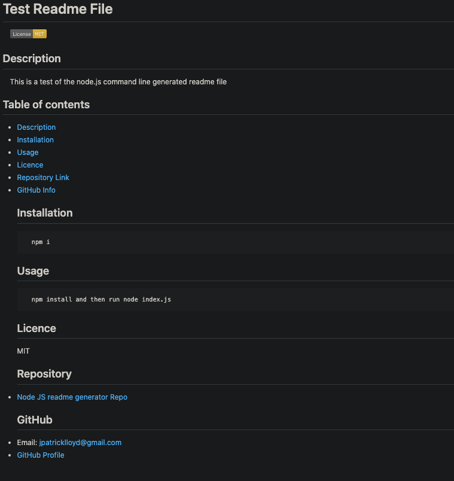

# **Node.js README generator**

## Description 
A quick and easy node.js command line application that auto generates a README.md file.

## Screenshots

## Table of contents
- [Description](#Description)
- [Installation](#Installation)
- [Usage](#Usage)
- [Licence](#Licence)
- [Repository Link](#Repository)
- [GitHub Info](#GitHub) 
## Installation
        npm i
## Usage
        Run npm install and then run node index.js
## License
MIT
## Repository
- [Node.js README generator Repo](https://github.com/meddle74/readmeGenerator)
- [Link to Video of Application](https://drive.google.com/file/d/1as1ACKgcpL5dH4c-phEMkipSEbGNLq3y/view?usp=sharing)
## GitHub
- Email: jpatricklloyd@icloud.com
- [GitHub Profile](https://github.com/Meddle74)
